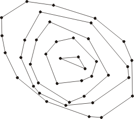

# Introduction

This R Markdown document summarizes the work I've done for a research school about scientific methodology and performance evaluation in computer science exposed by [Arnaud Legrand](http://mescal.imag.fr/membres/arnaud.legrand/) at the ENS Lyon. [This webpage](https://github.com/alegrand/SMPE) contains the lectures given during this research school.

### R Markdown ?

Markdown is a simple formatting syntax for authoring HTML, PDF, and MS Word documents. You can also include several contents, such as datas or code from your prefered language! For more details on using R Markdown see [this website](http://rmarkdown.rstudio.com>).

### The subject

My project deals with convex layers of 2D sets of integer points. The origin of this problem cames from arithmetic circuits, more precisely in the [tau conjecture](https://hal.inria.fr/ensl-00850791v2/document) for Newton polygons which, if we are able to prove it, implies that the permanent polynomial is not computable by polysize arithmetic circuits.

The convex layers of a set of points are the convex polygons obtained by successively "peeling" the convex hull of the set. I'm interested in some properties of this "peeling" process, for example : how many layers does a set of $n$ points can have ? How many points can we have on some particular layer ?  Note that the first layer corresponds to the convex hull of the set, and [some results](http://sarielhp.org/p/notes/rand_hull.pdf) already exists for the asymptotic number of elements of the convex hull for uniformly distributed points. Note that this asymptotic changes with the set in which we sample the points.



In this project, we are going to investigate only the first question using R. One can show that, if the $n$ points are uniformly distributed in **any bounded region** (with non empty interior), then the expected number of convex layers is $\Theta(n^{2/3})$. Note the difference with the asymptotic results for convex hulls, which changes with the region. But is this property true also for integer set of points ? So the goal is to have an idea of this behaviour in our discrete configuration.

# The experiment

Our goal is to gather measures of convex layers for "random" set of points. But since there is no uniform distribution on the natural number, how can we modelise this?

Instead, I choose to pick all the points uniformly in a $[0,N]\times[0,N]$ square of fixed size. The wanted number of points is handled by hand, i.e selected by the program. For sake of simplicity, I allow points to appear several times in this process. Consequently, to measure the real number of points in our set, we have to take this into account in the experiment.

As a conclusion, we can summarize the experiment as follows:

1. Pick a value for $N$ the size of the square.
2. For some values of $t$ the number of points do
3. Build $f(t)$ sets of $t$ points, and compute for each set its number of layers and its real number of points.
4. Put them all in a file.

The number of sets we build will be a function of $t$, simply because the combinatorial complexity of the possible sets increases with $t$. The function $f$ we should choose is not so obvious... For sake of simplicity (and lack of time) I choose $f(t) = 5*t$, because it seems to produces quite sufficient and "well-distributed" amount of data for this purpose.

In the `convexLayers.cpp` file, you can find the code of all the experiment, with all the geometrical part of the program, i.e. compute the layers (and some plotting functions to control what we are doing). For this geometrical part, I used the [DGtal library](http://dgtal.org/) for digital geometry.

# Results

To exploit the data coming from the experiment, I use... R! What a surprise, that's the goal of the research school.
More precisely we first load the data using:

```{r}
values <- read.csv("values.csv", header = T);
```

Let's see some of them:

```{r}
head(values)
```

These one are not so interesting, because we only see sets with few points.
Let's see what's happening with more complex sets:

```{r}
library("ggplot2")
ggplot(data=values, aes(monomials, layers)) + geom_point()
```

One shouldn't be surprised by the spots on the graphic: we are working with integers! The spots are a little bit wide horizontally, because of the story about the real number of different points when we sample. 
Concerning the number of layers, it seems to increase slowly with the number of points, but to determine if we have a polyrelation between the two quantities, we can use a log-representation of the data and build a linear regression in order to determine f such a relation exists. I use the following code:

```{r}
linear_equation <- function(df){
    m <- lm(y ~ x, df);
    eq <- substitute(italic(y) == a + b %.% italic(x)*","~~italic(r)^2~"="~r2, 
         list(a = format(coef(m)[1], digits = 2), 
              b = format(coef(m)[2], digits = 2), 
             r2 = format(summary(m)$r.squared, digits = 3)))
    as.character(as.expression(eq));                 
}

values$x = log(values$monomials);
values$y = log(values$layers);
p <- ggplot(data=values, aes(x,y)) + geom_point() + geom_smooth(method="lm")
p + geom_text(data=NULL, "x" = 5, "y" = 1.7, label = linear_equation(values), parse = TRUE)
```

We can notice that the slope of the regression line est 0.67, which is quite close to the $2/3$ the theory gives us for uniform points in the disk, which is against our initial intuition. Indeed, it seems that the combinatorics imposed by the integer point doesn't change the combinatorial complexity of the convex layers. In fact, we can have an idea of why it works : if we take a large value for $N$, by scaling the points, one can see our integer sets like uniform sets of points in the unit square, for which we have the same asymptotic results.

The $r^2$ coefficient if the [coefficient of determination](https://en.wikipedia.org/wiki/Coefficient_of_determination), which measure the quality of the linear regression. If it's close to $1$, that's our case here, it means that the regression line we found fits very well the data. So this information strengthens our previous observation.

# Conclusion

As a conclusion, our experiment about the number of convex layers of sets of integer points and its interpretation using R convice us that the asymptotics for integer points sets and for general points sets in $\Theta(n^{2/3})$ should be the same. Whereas a proof for the uniform case exists, such a proof for our case is unknown, because of the combinatorial counterpart imposed by the integer coordinates.

As an improvement, one can investigate some layers in more details, for example the second layer. What's more, in the experiments, there are a lot of details we can improve or think about, for example our hypothesis about the bounding square, or the number of experiments chosen for each number of points.

A last point one can improve is that in our arithmetic circuit initial goal, we are dealing with Newton polygons associated to products of polynomials, and one can observe that some configurations of points cannot happen with such product (for example for polygons associated to irreducible polynomials). How to take with into account in our simulation ? 
